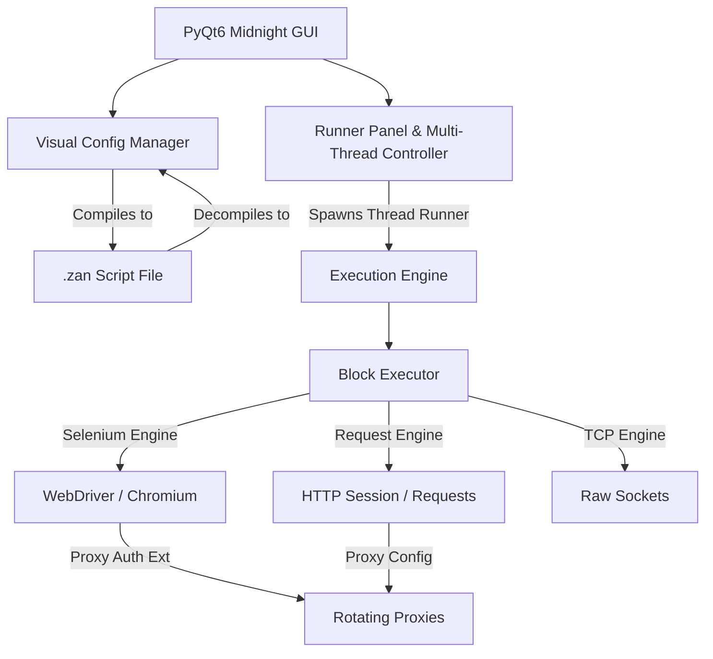

#  One Bullet

[](https://www.python.org/)
[](https://www.qt.io/)
[](https://www.selenium.dev/)
[](LICENSE)

**One Bullet** is a state-of-the-art, high-performance web automation, data scraping, and security testing platform. Combining the flexibility of a visual scripting framework with the power of PyQT6 and Selenium, One Bullet enables developers and security researchers to design, debug, and run automated workflows at scale.

Built around a custom **Midnight Dark Palette with Neon Cyan Accents**, the user interface is optimized for long sessions and provides a smooth, premium experience.

---

## 🌟 Key Features

*   **⚡ Dual-Engine Core**:
    *   **Selenium WebDriver Engine**: For full browser automation, dealing with complex JavaScript, and bypass challenges.
    *   **HTTP Request Engine**: Lightweight, lightning-fast requests utilizing persistent sessions for API-level tasks.
    *   **Raw TCP Engine**: Low-level socket support for custom networking protocols.
*   **🧩 Visual Block Scripting (One Script Framework)**:
    *   Construct scripts visually using functional blocks (`REQUEST`, `NAVIGATE`, `PARSE`, `KEY CHECK`, `BYPASS CF`, `TCP`, `UTILITY`).
    *   Includes a compiler to serialize visual flows to custom `.zan` scripts, and a decompiler to load them back.
*   **🛡️ Proxy & Security Management**:
    *   Supports HTTP, HTTPS, SOCKS4, and SOCKS5 proxies with rotation and thread safety.
    *   Dynamic proxy authentication extension generation for Chrome, resolving standard WebDriver limitations.
    *   Cloudflare challenge auto-bypass blocks.
*   **🔍 Multi-Mode Data Parser**:
    *   Extract information dynamically using Left-Right boundaries (`LR`), JSON Path parsing, CSS Selectors (via BeautifulSoup), or Regular Expressions (`REGEX`).
*   **📊 Database & Hit Tracker**:
    *   Track successful hits, captures, and performance metrics in real-time.
    *   Local JSON database store to review and export results.

---

## 📐 System Architecture



---

## 📁 File Structure

```text
OneBullet/
├── assets/
│   └── logo.jpg               # Application Logo
├── configs/
│   ├── fb Email bf.zan        # Example configuration for testing
│   └── resquest.zan           # Example request block configuration
├── engine/
│   ├── block_executor.py      # Core parser/executor for visual blocks
│   ├── runner_engine.py       # Multi-threaded runner orchestration
│   └── selenium_engine.py     # Selenium WebDriver compiler/controller
├── ui/
│   ├── about_tab.py           # Credits, system specifications, and developer info
│   ├── configs_tab.py         # Visual block script designer & editor
│   ├── debugger_widget.py     # Live execution sandbox and variable inspector
│   ├── hits_db_tab.py         # Successful captures database and statistics
│   ├── main_window.py         # Core PyQt6 window structure and stylesheet styling
│   ├── plugins_tab.py         # Plugin management
│   ├── proxies_tab.py         # Proxy loading, testing, and formatting
│   ├── runner_tab.py          # Multithreading console, start/stop and bots config
│   ├── settings_tab.py        # Global browser settings and engine configurations
│   ├── tools_tab.py           # Wordlist utilities and tools
│   ├── utilities_tab.py       # General selenium settings and logs
│   └── wordlists_tab.py       # Wordlist database loader and viewer
├── utils/
│   └── helpers.py             # Custom stylesheets, settings loading, and helpers
├── main.py                    # App entry point
├── settings.json              # Persistent global settings
└── wordlists.json             # Loaded wordlist registry
```

---

## 🚀 Installation

### Prerequisites

Ensure you have **Python 3.8 or higher** installed. You will also need Chrome or another supported browser if you plan to use the Selenium engine.

1.  **Clone the Repository**:
    ```bash
    git clone https://github.com/CodeZANKO/OneBullet.git
    cd OneBullet
    ```

2.  **Install Dependencies**:
    ```bash
    pip install -r requirements.txt
    ```

3.  **Run the Application**:
    ```bash
    python main.py
    ```

---

## 🛠️ Usage Guide

### 1. Designing a Configuration
1. Navigate to the **Configs** tab.
2. Select **New Config** or load an existing `.zan` file.
3. Add blocks to control execution flow:
   * **Request**: To fetch web pages or submit forms via HTTP.
   * **Parse**: To grab tokens, CSRF tokens, or user data.
   * **Key Check**: Define what constitutes a successful login, a bad credential, or a ban/rate limit.
   * **Bypass CF**: Add Cloudflare challenge solvers if required.

### 2. Setting Up Proxies
* Head to the **Proxies** tab.
* Paste your proxies, select the format (e.g., `IP:Port` or `IP:Port:User:Pass`), specify the type (`HTTP`/`SOCKS5`), and click **Import**.
* Run a quick test to filter out dead proxies.

### 3. Launching a Run
* Go to the **Runner** tab.
* Select your compiled configuration.
* Load a wordlist (combolist) from the **Wordlists** tab.
* Select the number of concurrent threads (bots) and press **Start**.

---

## 📝 Configuration File Syntax (`.zan`)

Configurations in One Bullet are compiled to a clean line-based syntax. Example snippet:

```text
BLOCK:NAVIGATE url="https://example.com/login" timeout="60" ban_on_timeout="false"
BLOCK:ELEMENTACTION selector_type="ID" selector="username" action="SendKeys" value="my_username"
BLOCK:ELEMENTACTION selector_type="ID" selector="password" action="SendKeys" value="my_password"
BLOCK:ELEMENTACTION selector_type="XPATH" selector="//button[@type='submit']" action="Click"
BLOCK:KEYCHECK keychains="[{'type': 'Success', 'mode': 'OR', 'keys': ['Welcome back!']}]"
```

---

## ⚖️ License

Distributed under the MIT License. See `LICENSE` for more information.

## ⚠️ Disclaimer

*This tool is designed for educational purposes, authorized penetration testing, and web scraping operations under explicit permission. The developer is not responsible for any misuse or damage caused by this software.*
